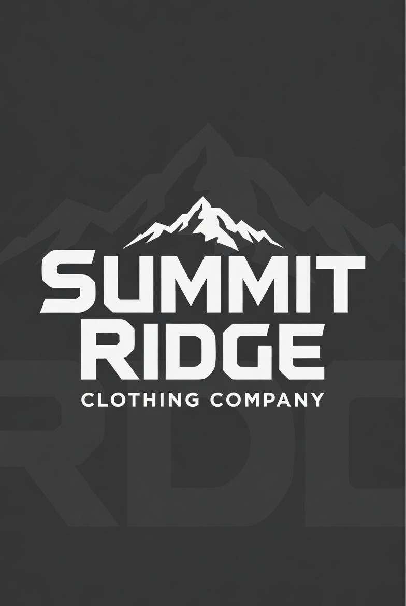

# IT Ticketing and Asset Management System 
## IS 436 -- Team G

## Project Overview
This project is a centralizd IT ticketing system and asset management system for Summit Ridge Clothing Company

## Main Features
- Submit and Track IT Tickets
-  Notifications for ticket Updates
-  Ability To Assign IT staff and to change Prioritazation
-  Track Hardware and Software Licences 
-  Role Based Access Control (RBAC)
-  Scalable to fit the organizations needs

## Business Values
- Faster Ticket Resolution 
- Less Downtime for retail locations
- Reduced Equipment Loss
- Improved Efficiency

## Methodology
Agile Development with multiple sprint cycles

## Team Members
- Alex Gilbert: Quality Assurance & Development
- Aleesha Iqbal: Project Manager
- Tran Hoang: UI/UX
- Ore Faluyi: Database Engineer
- Quan Tran: Business Analyst